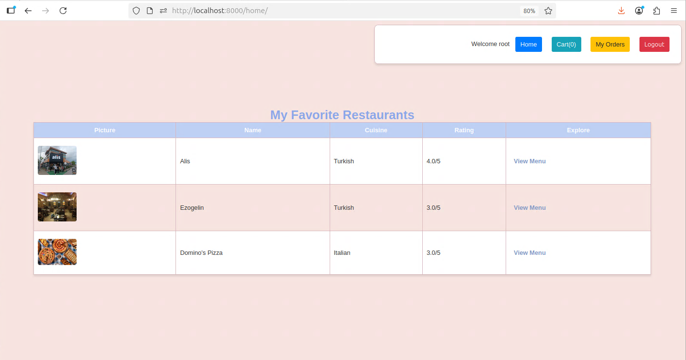
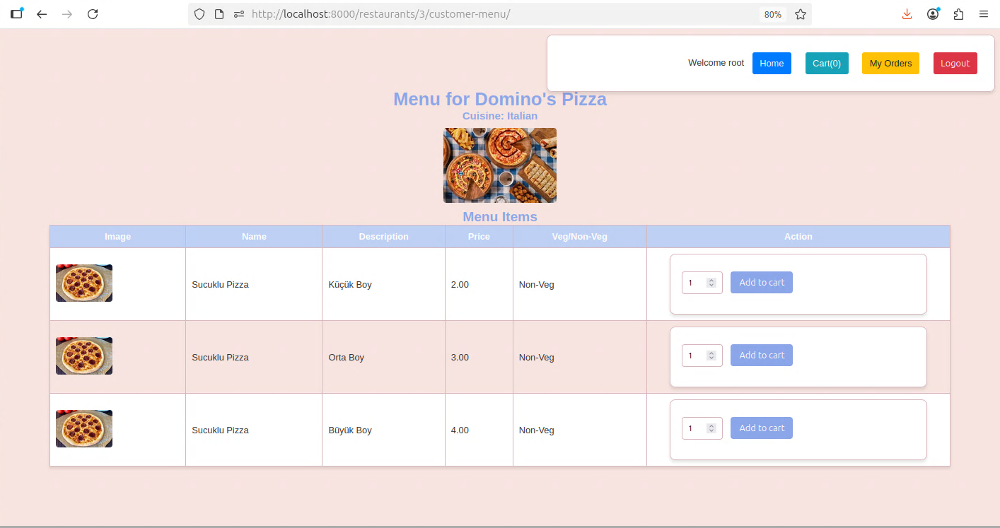
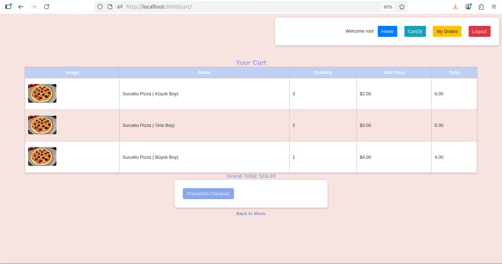
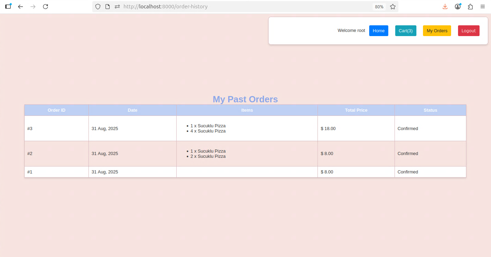
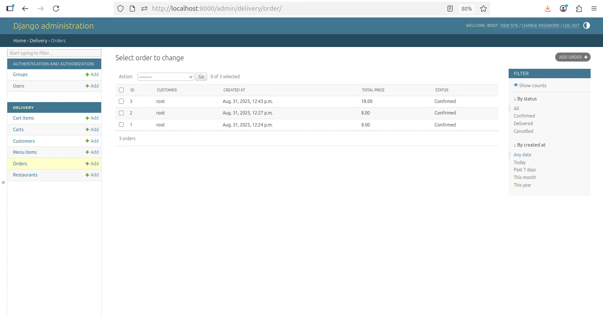

# Meal Mate - Django Food Delivery App

This is a Django-based web application for food delivery, allowing customers to browse restaurants, add items to a cart, and place orders. The entire development environment is containerized using Docker and Docker Compose for consistency and ease of setup.


---

## Prerequisites

Before you begin, ensure you have the following software installed on your system:

1.  **Git:** For cloning the repository.
2.  **Docker Desktop:** This provides both Docker Engine and Docker Compose. It is the standard for macOS and Windows. For Linux, you can install Docker Engine and Docker Compose separately or use Docker Desktop.
    * Download from: [docker.com/products/docker-desktop/](https://www.docker.com/products/docker-desktop/)

---

## Local Setup Instructions

Follow these steps to set up and run the project on your local machine.

### 1. Clone the Repository
Open your terminal and clone the project from GitHub.
```bash
git clone [https://github.com/GGurol/meal-mate.git](https://github.com/GGurol/meal-mate.git)
cd meal-mate
```

### 2. Build and Start the Docker Containers
This command will build the Docker image from the `Dockerfile` and start the application container in the background. The first build may take a few minutes.

```bash
docker compose up --build -d
```
* `--build`: Forces Docker to build the image. Run this the first time or after changing the `Dockerfile` or `requirements.txt`.
* `-d`: Runs the container in "detached" (background) mode.

### 3. Set Up the Database
Once the container is running, open a **new terminal** and run the following commands to create the database schema and tables.

#### a. Create Migration Files
This command checks your `models.py` for changes and creates the necessary migration files.
```bash
docker compose exec app python manage.py makemigrations
```

#### b. Apply Migrations
This command reads the migration files and creates all the tables in the database.
```bash
docker compose exec app python manage.py migrate
```

### 4. Create a Superuser (Admin)
To access the Django admin panel, you need to create a superuser. This command will prompt you to enter a username, email, and password.
```bash
docker compose exec app python manage.py createsuperuser
```

**Setup is now complete!** ✅

---

## Usage

* **Application URL:** Open your web browser and navigate to:
    **`http://localhost:8000`**

* **Admin Panel URL:** To manage the site's data (e.g., add restaurants), navigate to:
    **`http://localhost:8000/admin`**
    (Log in with the superuser credentials you created in Step 4).

---

## Daily Workflow Commands

* **To start the application:**
    ```bash
    docker compose start
    ```
* **To stop the application:**
    ```bash
    docker compose stop
    ```
* **To view live logs:**
    ```bash
    docker compose logs -f web
    ```
* **To run any other `manage.py` command:**
    Prefix it with `docker compose exec app`.
    ```bash
    # Example:
    docker compose exec app python manage.py showmigrations
    ```
* **To stop and remove containers:**
    ```bash
    docker compose down
    ```

## Screenshots







